# JS

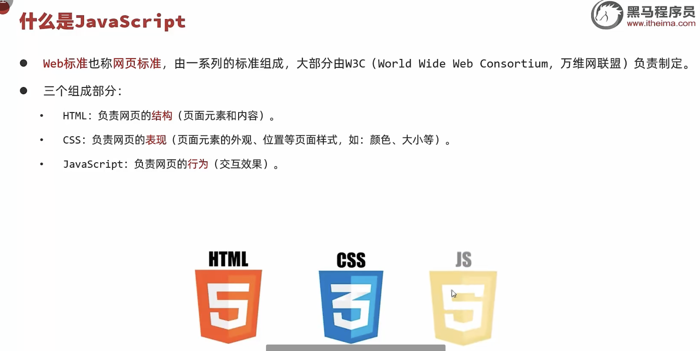

• Javascript（简称：JS）是一门跨平台、面向对象的脚本语言，是用来控制网页行为，实现页面的交互效果。Javascript 和 Java 是完全不同的语言，不论是概念还是设计。但是基础语法类似。
• 组成：
	• ECMAScript：规定了JS基础语法核心知识，包括变量、数据类型、流程控制、函数、对象等。
	• BOM：浏览器对象模型，用于操作浏览器本身，如：页面弹窗、地址栏操作、关闭窗口等。
	• DOM：文档对象模型，用于操作HTML文档，如：改变标签内的内容、改变标签内字体样式等。


## JS 核心语法

### 引入方式

• 内部脚本：将JS代码定义在HTML页面中

> JavaScript代码必须位于 <script></script> 标签之间
> 在HTML文档中，可以在任意地方，放置任意数量的<script>
> 一般会把脚本置于 <body>元素的底部，可改善显示速度

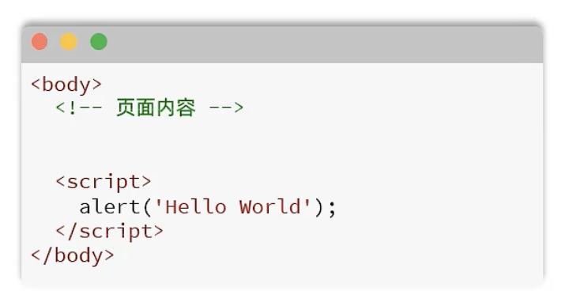

• 外部脚本：将 JS代码定义在外部 JS文件中，然后引入到HTML页面中

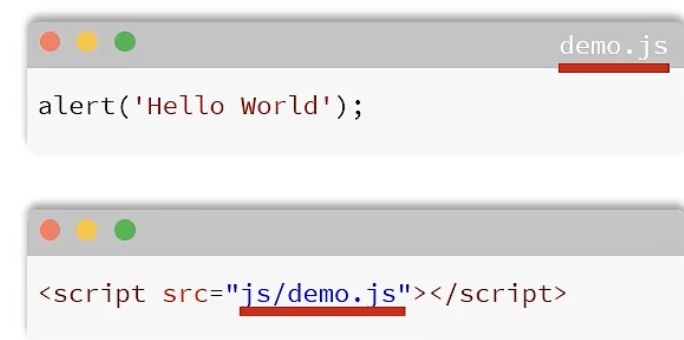

### 基础语法

#### 变量和常量

• JS中用 let 关键字来声明变量（弱类型语言，变量可以存放不同类型的值）。
• 变量名需要遵循如下规则：
• 只能用 字母、数字、下划线（_）、美元符号（$）组成，且数字不能开头
• 变量名严格区分大小写，如 name 和 Name 是不同的变量
• 不能使用关键字，如：let、var、if、for等

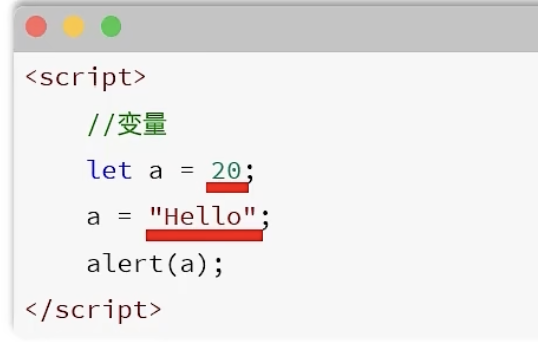

• JS中用 const 关键字来声明常量。
• 一旦声明，常量的值就不能改变（不可以重新赋值）。

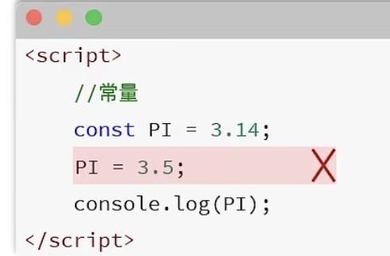

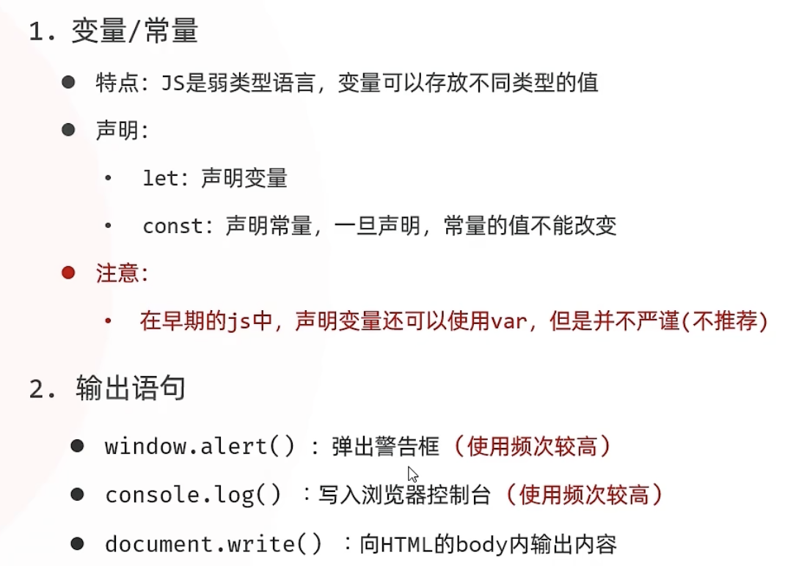

#### 数据类型

• JavaScript的数据类型分为：基本数据类型和引用数据类型（对象）。
• 基本数据类型：
	number：数字（整数、小数、NaN（Not a Number））
	boolean：布尔。true，false
	null：对象为空。Javascript是大小写敏感的，因此null、NUll、NULL是完全不同的
	undefined： 当声明的变量未初始化时，该变量的默认值是 undefined
	string：字符串，单引号、双引号、反引号皆可，推荐使用单引号

•使用typeof 运算符可以获取数据类型：

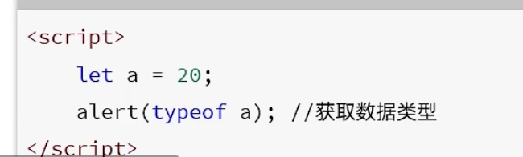

```js
//1．数据类型
alert （tYPeof 10）； //number
alert （tYPeof 1.5）； //numoer
alert （tYPeot true）i //boolean
alert （tYPeof talse）；//boolean
alert （tyPeof "He11o"）；//string
alert （typeof 'Js'）； //string
alert （typeof `Javascript` ）； //string
alert（typeof nul1）；//object
let a;
alert （typeof a）; //undefined
```

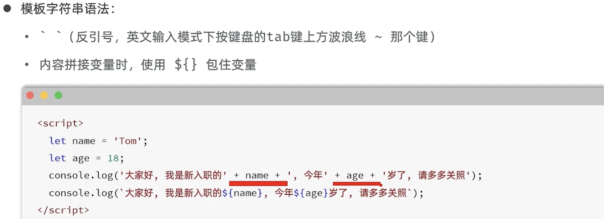


#### 函数

• 介绍：函数（function ）是被设计用来执行特定任务的代码块，方便程序的封装复用。
• 定义：Javascript中的函数通过function关键字进行定义，语法为：

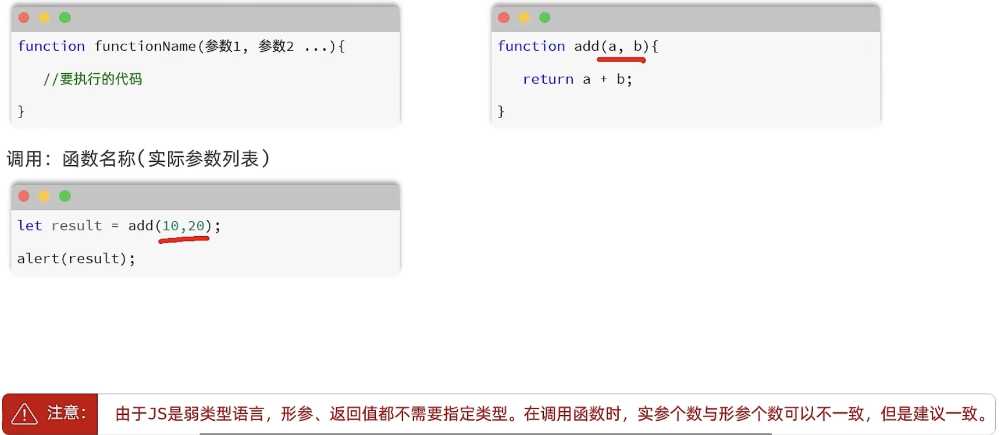


匿名函数
• 匿名函数是指一种没有名称的函数，可以通过两种方式定义：函数表达式 和 箭头函数。

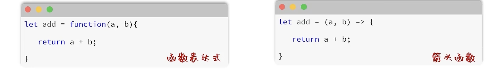

• 匿名函数定义后，可以通过变量名直接调用。

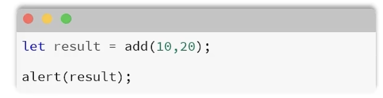


#### 自定义对象

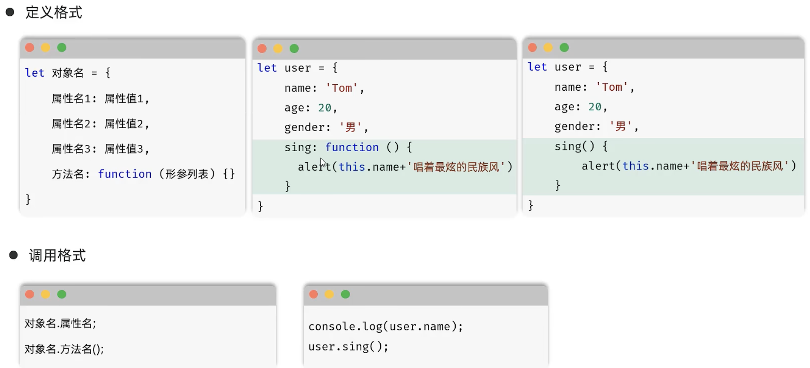

注意：在自定义对象中，如果有函数，不要使用箭头函数

##### json

• 概念：Javascript Object Notation, Javascript对象标记法（JS对象标记法书写的文本）。
• 由于其语法简单，层次结构鲜明，现多用于作为数据载体，在网络中进行数据传输。

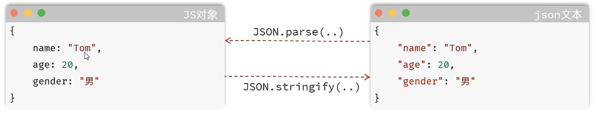

仅仅是看起来像，但是不是一个东西

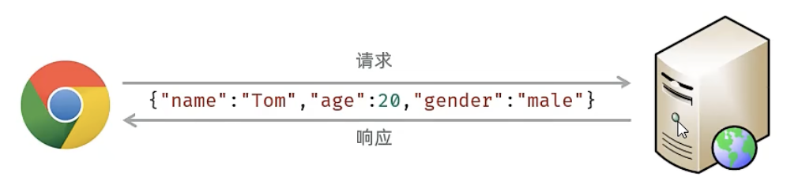

1.JSON格式特点？
• json格式的文本所有的key必须使用双引号引起来
2． JSON对象的两个方法？
• JSON.parse ：将json字符串转为js对象
• JSON.stringify：将js对象转为json宝符串


#### DOM

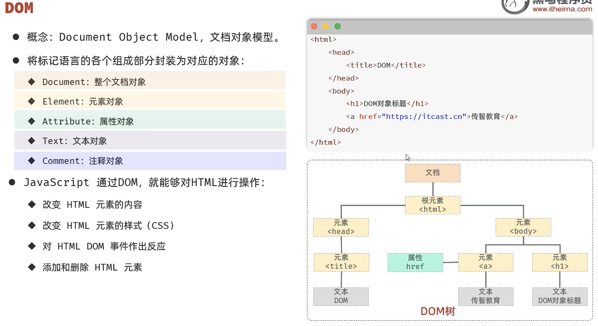

1. 什么是DOM ？
  • 文档对象模型，JS提供的专门用来操作网页内容的

2.  如何获取DOM对象？
  • document.querySelector（'选择器'）
  • document.querySelectorAll（'选择器'）

3. 其他方式（了解）早期方法：

  • document.getElementById（'id'）
  • document.getElementsByTagName（'div'）
  • document.getElementsByClassName（'cls'）

  

## JS 事件监听

什么是事件？什么是事件监听？
事件：HTML事件是发生在HTML元素上的“事情”。比如：
	• 按钮被点击
	• 鼠标移动到元素上
	• 按下键盘按键
事件监听：Javascript可以在事件触发时，就立即调用一个函数做出响应，也称为 事件绑定或注册事件。

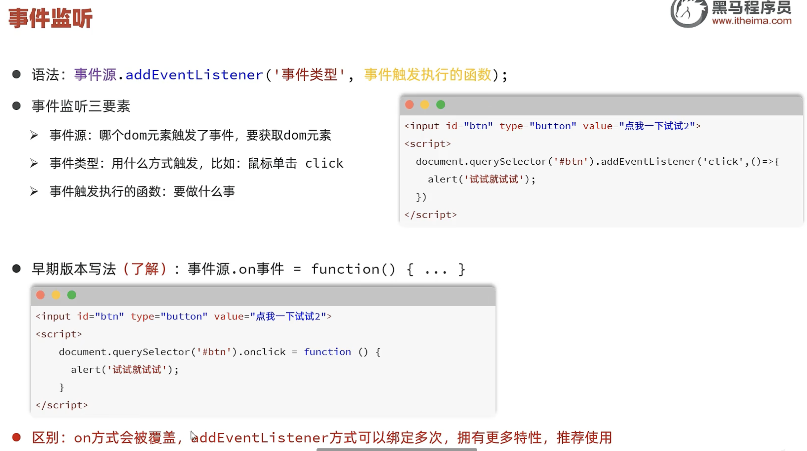

实现表格数据行鼠标移入移出隔行换色效果

```js
        // 鼠标移入移出事件
        let trs = document.querySelectorAll('tr') // 获取所有表格行
        for(let i = 0;i<trs.length;i++){
            trs[i].addEventListener('mouseenter', function() { // 鼠标移入
                trs[i].style.backgroundColor = '#f2e2e2'; // 设置背景色
            });
            trs[i].addEventListener('mouseleave', function() { // 鼠标移出
                trs[i].style.backgroundColor = '#fff';
            });
        }
```

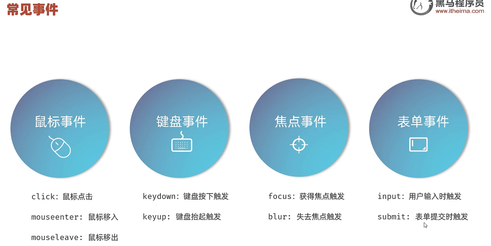

要注意：如果函数要暴露出去，才能在其他的文件里面进行导入

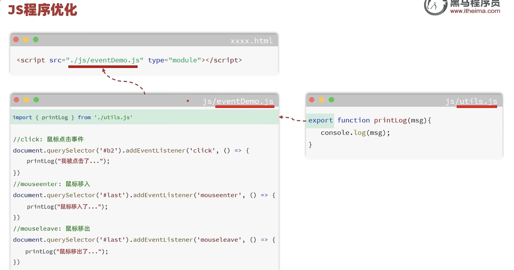