# Vue

什么是vue

Vue是一款用于构建用户界面的渐进式的JavaScript框架。（官方：https://cn.vuejs.org/）

框架：就是一套完整的项目解决方案，用于快速构建项目。
优点：大大提升前端项目的开发效率。
缺点：需要理解记忆框架的使用规则。（参照官网）

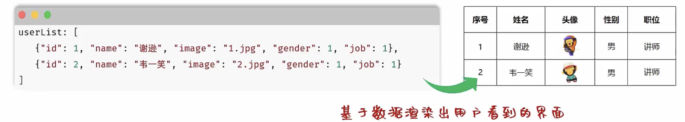

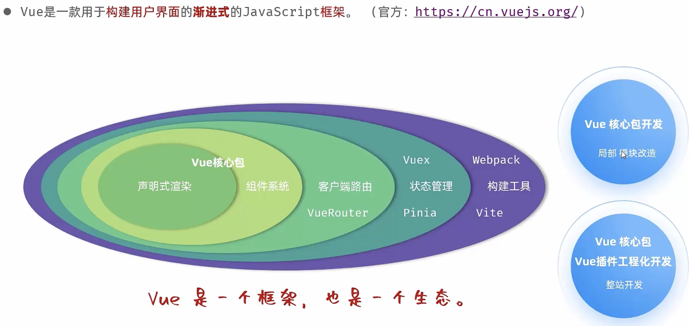

## Vue快速入门

基子数据渲染出用户看到的页面数据驱动视图

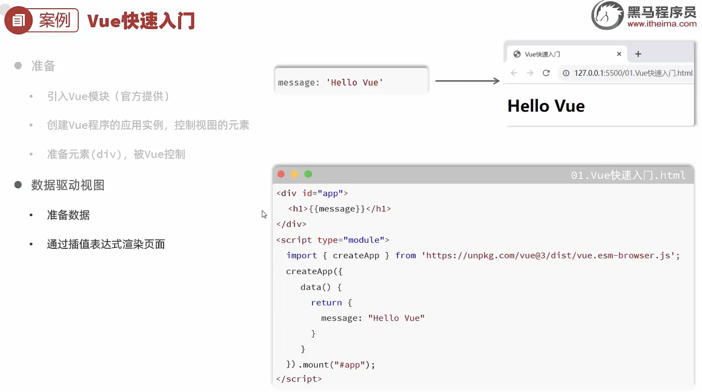

1.Vue的使用步骤？
准备工作
•引入Vue模块
• 创建Vue的应用实例
• 定义元素（div），交给Vue控制
数据驱动视图
• 准备数据
• 用插值表达式渲染

```js
<!DOCTYPE html>
<html lang="en">
<head>
    <meta charset="UTF-8">
    <meta name="viewport" content="width=device-width, initial-scale=1.0">
    <title>VueTest</title>
</head>
<body>
    <div id="app">
        <h1>{{ message }}</h1>
        <h2>{{ countwz }}</h2>
    </div>
</body>
    <script type="module">
        import { createApp } from 'https://unpkg.com/vue@3/dist/vue.esm-browser.js';
        const App = {
            data() {
                return {
                    message: 'Hello Vue!',
                    countwz: 999999
                };
            }
        };
        createApp(App).mount('#app');
    </script>
</body>
</html>
```


## Vue常用指令

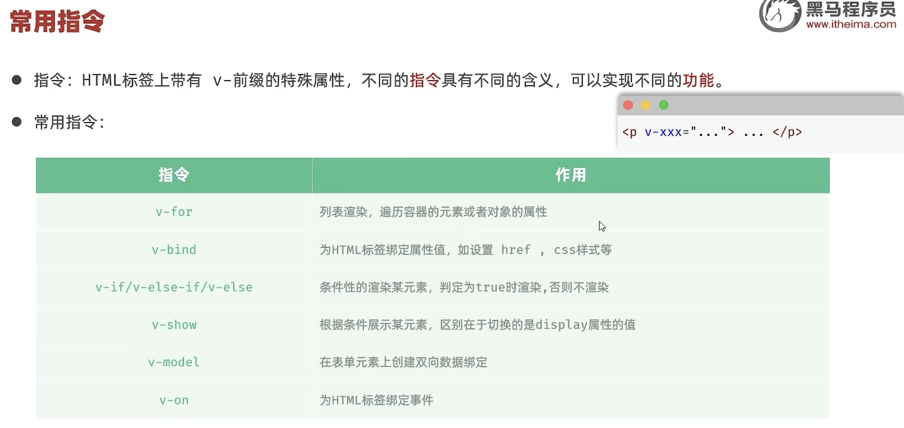

### **v-for**

作用：列表渲染，遍历容器的元素或者对象的属性
语法：

```js
<tr v-for="(item, index)in items" :key="item.id">{{fitem}}</tr>
```

**参数说明**：
• items 为遍历的数组
• item 遍历出来的元素
• index 为索引/下标，从0开始；可以省略，省略index语法：v-for="item in items
**key**：
• 作用：给元素添加的唯一标识，便于vue进行列表项的正确排序复用，提升渲染性能
• 推荐使用id作为key（唯一），不推荐使用index作为key（会变化，不对应）

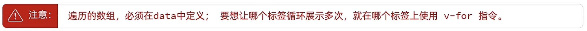

还有一个要注意的地方就是，在插值表达式是不能用在标签内部的

### **v-bind**

作用：动态为HTML标签绑定属性值，如设置href，src，style样式等。
语法：v-bind：属性名="属性值"

```js

```

简化：:属性名="属性值"

```js

```


### v-if & v-show

作用：这两类指令，都是用来控制元素的显示与隐藏的
**• v-if**
语法：v-if="表达式"，表达式值力 true，显示；false，隐藏
原理：基于条件判断，来控制创建或移除元素节点（条件渲染）

场景：要么显示，要么不显示，不频繁切换的场景
其它：可以配合 v-else-if / v-else 进行链式调用条件判断


**•v-show**
语法：v-show="表达式"，表达式值为 true，显示；false，隐藏
原理：基于CSS样式display来控制显示与隐藏

场景：频繁切换显示隐藏的场景


### **v-model**

作用：在表单元素上使用，双向数据绑定。可以方便的  获取 或  设置  表单项数据

语法：v-model="变量名"


### **v-on**

作用：为html标签绑定事件（添加事件监听）
语法：
• v-on：事件名="方法名"
• 简写为 @事件名="..."

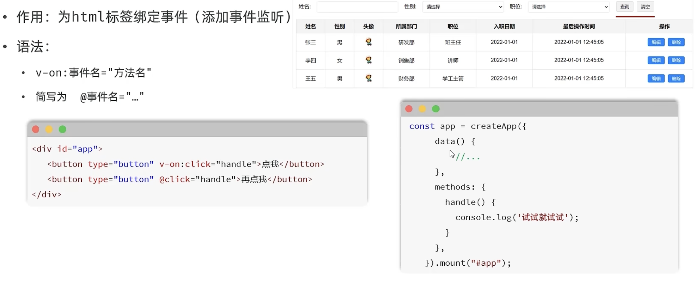


## Ajax

### 入门

介绍：Asynchronous Javascript And XML，异步 的JavaScript和XML①。

作用：
• 数据交换：通过Ajax可以给服务器发送请求，并获取服务器响应的数据。
• 异步交互：可以在不重新加载整个页面的情况下，与服务器交换数据并更新部分网页的技术，如：搜索联想、用户名是否可用的校验等等。

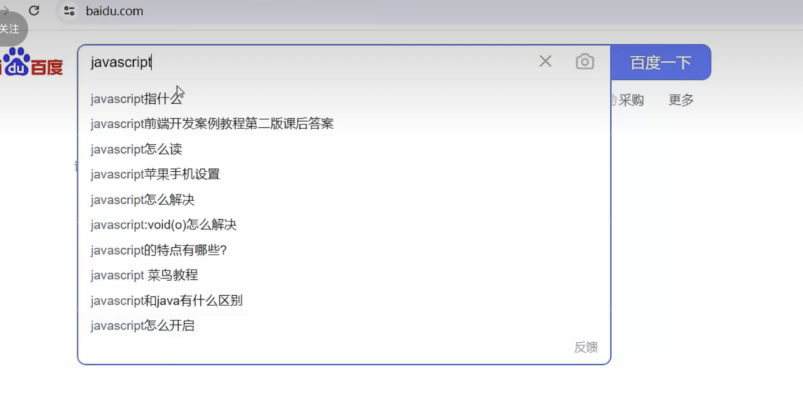

整体页面不更新，仅仅更新搜索框

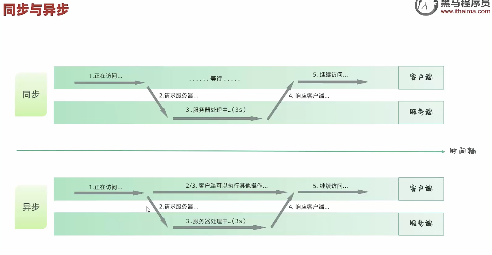

**Axios**
•介绍：Axios 对原生的Ajax进行了封装，简化书写，快速开发。
•官网：https:/www.axios-http.cn/
• 步骤：
引入Axios的js文件（参照官网）
使用Axios发送请求，并获取响应结果

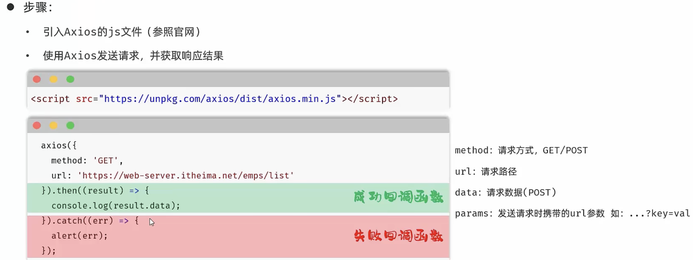

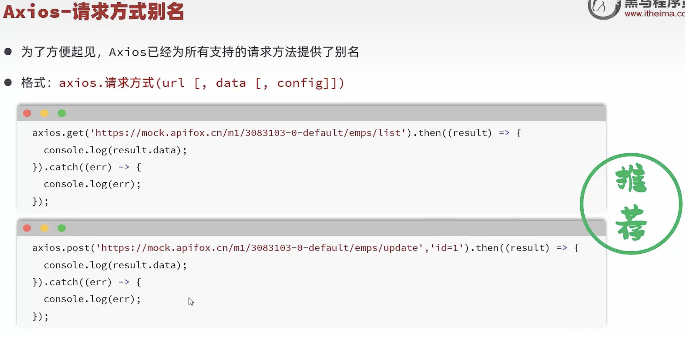

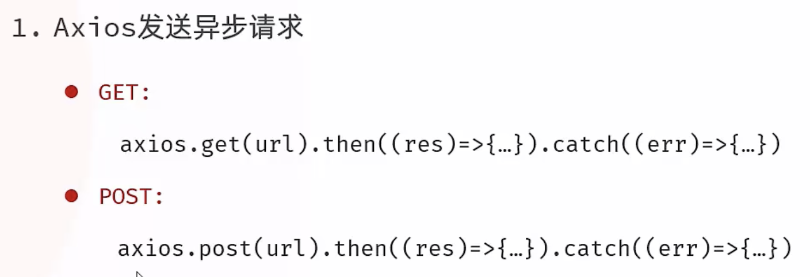

### 案例

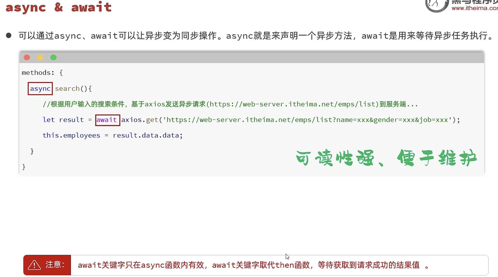


## **vue的生命周期**

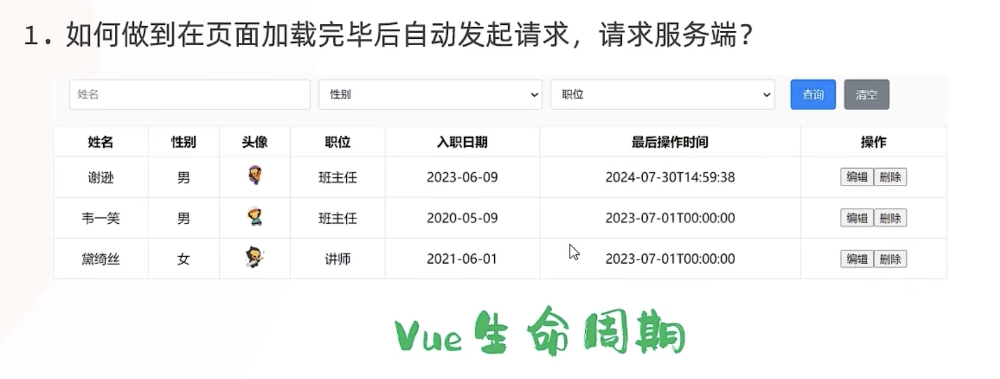

生命周期：指一个对象从创建到销毁的整个过程。
生命周期的八个阶段：每触发一个生命周期事件，会自动执行一个生命周期方法（钩子）。

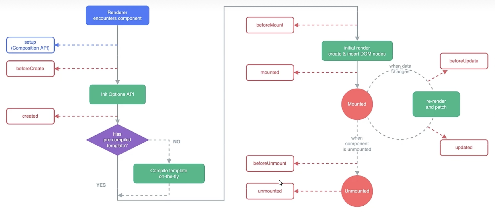

生命周期的八个阶段：每触发一个生命周期事件，会自动执行一个生命周期方法（钩子）

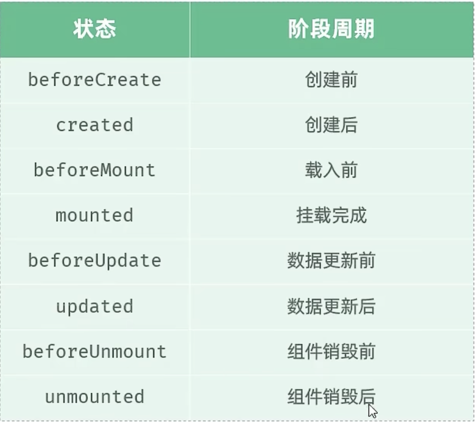

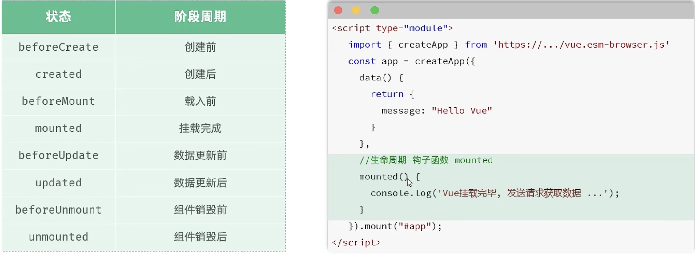